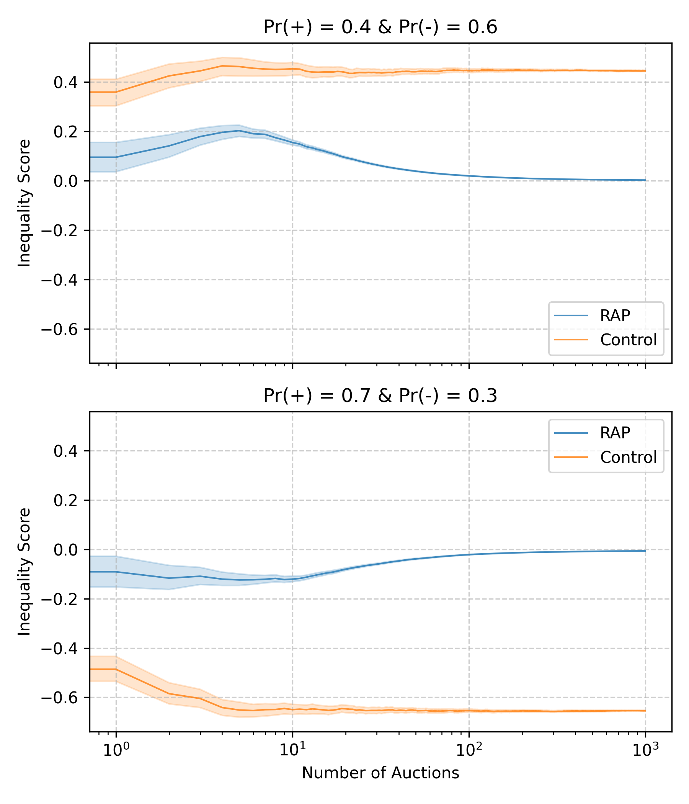

<h1 align="center">Repeated Auction Design</h1>



A solution to the first GTAC project.

## 🛠️ Installation
Before running the project, it makes sense to isolate the environment
```bash
python3.12 -m venv venv
```
and install the relevant packages
```bash
pip3 install -r requirements.txt
```

## 📊 Visualisation
Run the project using the script below. This script simulates auctions, measures the inequality associated with each, and finally creates a visualisation of the collected data (as seen in the image above).
```bash
python main.py
```

